# 🛡️ Threat Intelligence & Vulnerability Assessment on WPA2-Personal Networks

### From 4-Way Handshake Capture to MitM Risk Mitigation

> **Mata Kuliah:** Cyber Threat Intelligence (CTI)\
> **Dosen Pengampu:** \[Runal Rezkiawan,S.Kom.,M.T\]\
> **Disusun Oleh:** \[NUR ALIYAH AMALIANI\]\
> **NIM:** \[105841106923\]\

------------------------------------------------------------------------

## 📌 Tentang Proyek

Proyek ini merupakan dokumentasi analisis keamanan **WPA2-Personal
(PSK)** pada lingkungan laboratorium/jaringan uji. Analisis dilakukan
melalui pengamatan lalu lintas jaringan, *packet capture*, identifikasi
**WPA2 4-Way Handshake (EAPOL)**, serta pemetaan potensi ancaman
menggunakan **MITRE ATT&CK**.

Tujuan utama proyek adalah:

-   Mengamati proses discovery pada jaringan nirkabel.
-   Mengidentifikasi WPA2 4-Way Handshake.
-   Mengamati ANonce, SNonce, MIC, serta proses pertukaran kunci.
-   Mendokumentasikan risiko *offline dictionary attack* terhadap
    WPA2-PSK.
-   Menganalisis risiko ARP Spoofing / Man-in-the-Middle pada jaringan
    lokal.
-   Menghubungkan hasil pengujian dengan MITRE ATT&CK dan KRACK.
-   Menyusun rekomendasi mitigasi untuk meningkatkan keamanan jaringan
    nirkabel.

> ⚠️ **Ethical Notice:** Seluruh pengujian pada proyek ini dilakukan
> pada jaringan/laboratorium yang digunakan untuk kepentingan
> pembelajaran dan memiliki izin. Repository ini dibuat untuk
> dokumentasi akademik Cyber Threat Intelligence.

------------------------------------------------------------------------

## 🧪 Lingkungan Pengujian

  Komponen                  Keterangan
  ------------------------- --------------------------------------
  Sistem Operasi Analisis   Kali Linux
  Packet Analyzer           Wireshark
  Wireless Tools            Aircrack-ng Suite
  Tools yang Dibahas        `airmon-ng`, `airodump-ng`
  Target                    SSID/Jaringan uji
  Protokol                  IEEE 802.11, EAPOL, DHCP, ARP
  Keamanan Wireless         WPA2-Personal (PSK)
  Data Analisis             Packet Capture (`.pcap` / `.pcapng`)

------------------------------------------------------------------------

# 🔬 Tahapan dan Bukti Pengujian

## 1. Persiapan Environment

Tahap pertama memastikan lingkungan pengujian telah siap dan perangkat
wireless dapat digunakan pada Kali Linux.

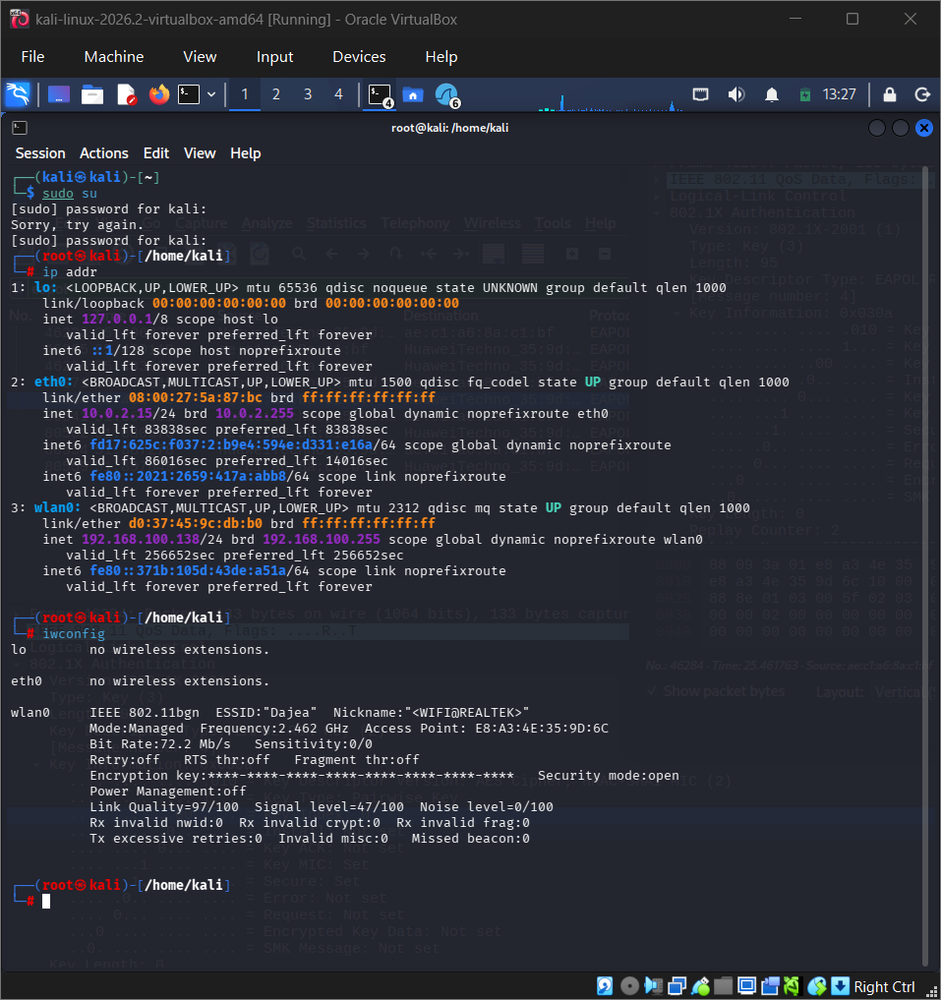

------------------------------------------------------------------------

## 2. Monitor Mode

Wireless interface dipersiapkan untuk melakukan pengamatan terhadap
frame IEEE 802.11 pada lingkungan pengujian.


------------------------------------------------------------------------

## 3. Network Discovery

Tahap discovery digunakan untuk mengidentifikasi jaringan uji dan
informasi wireless yang relevan sebelum analisis traffic dilakukan.

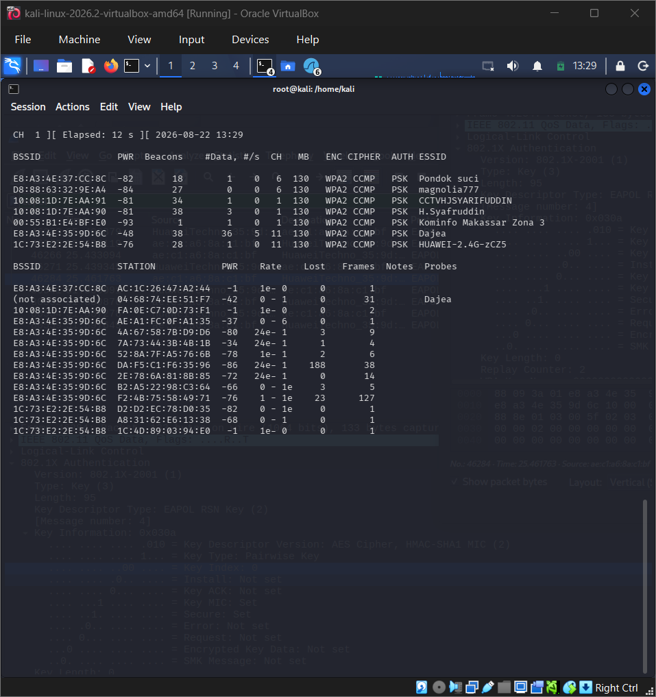

------------------------------------------------------------------------

## 4. Identifikasi Traffic EAPOL di Wireshark

Hasil packet capture dianalisis menggunakan Wireshark. Filter EAPOL
membantu mengisolasi paket yang berhubungan dengan proses autentikasi
WPA2.

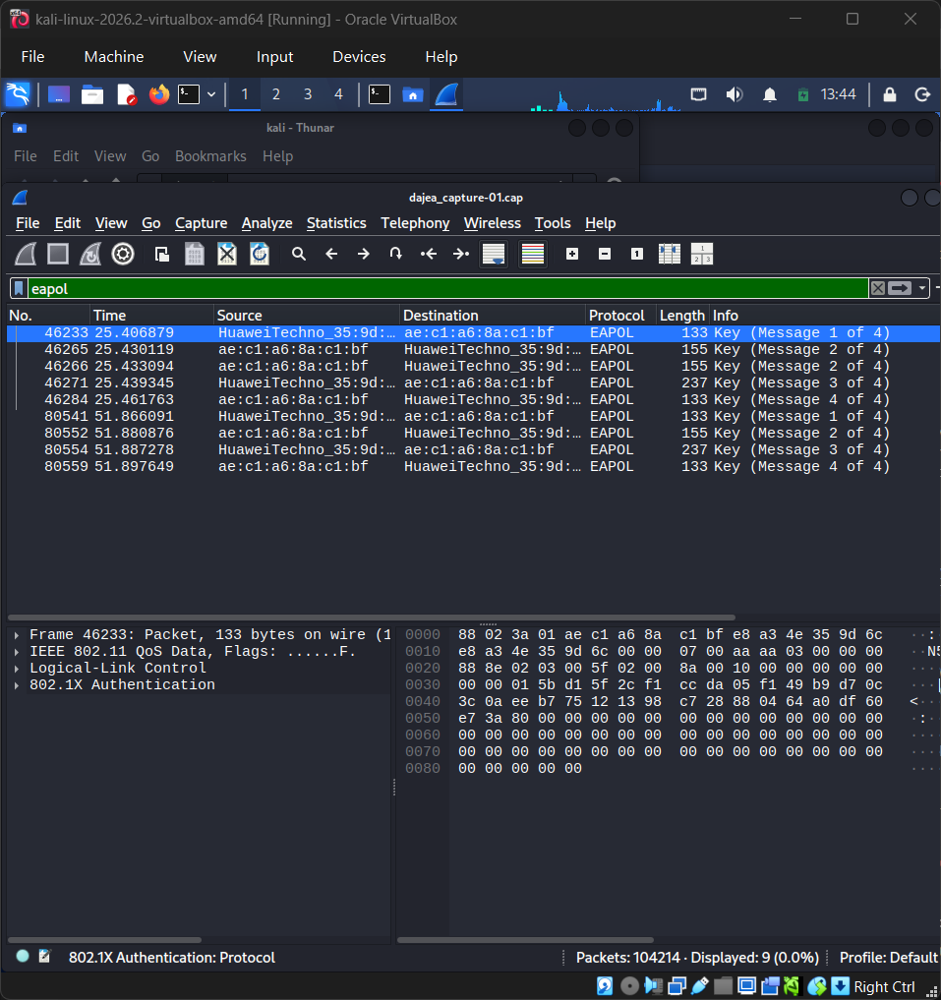

------------------------------------------------------------------------

## 5. Detail Paket EAPOL

Paket EAPOL diperiksa lebih lanjut untuk memahami informasi yang
dipertukarkan antara Access Point (AP) dan client selama proses
autentikasi.

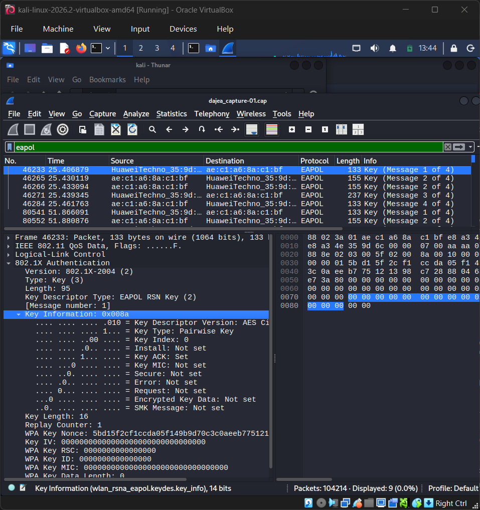

------------------------------------------------------------------------

## 6. Verifikasi Handshake pada Data Capture

Data capture diperiksa untuk memastikan handshake WPA2 yang dibutuhkan
untuk analisis telah terekam.


------------------------------------------------------------------------

## 7. Wordlist pada Pengujian Laboratorium

Pengujian laboratorium juga mendokumentasikan penggunaan wordlist untuk
menunjukkan mengapa PSK yang lemah dapat meningkatkan risiko *offline
dictionary attack*.

> Untuk repository publik, jangan menampilkan password jaringan pribadi
> atau kredensial yang masih aktif.

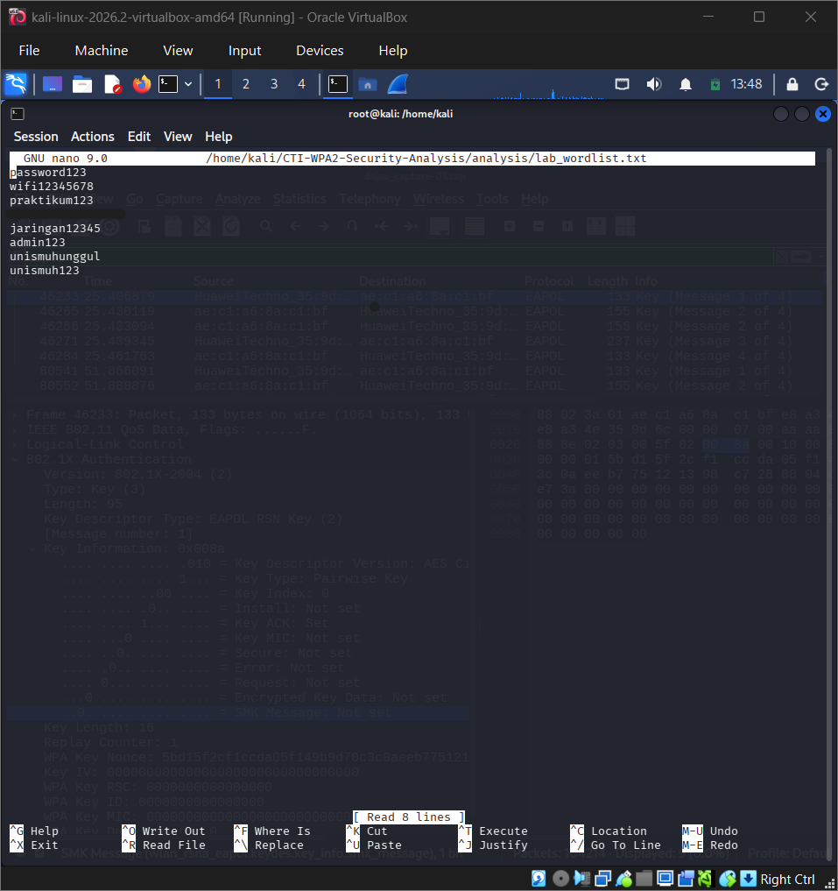

------------------------------------------------------------------------

## 8. Hasil Pengujian PSK pada Lab

Bukti berikut mendokumentasikan hasil pengujian terhadap PSK pada
jaringan laboratorium. Tahap ini digunakan untuk menunjukkan risiko
penggunaan password WPA2 yang lemah atau mudah ditebak.

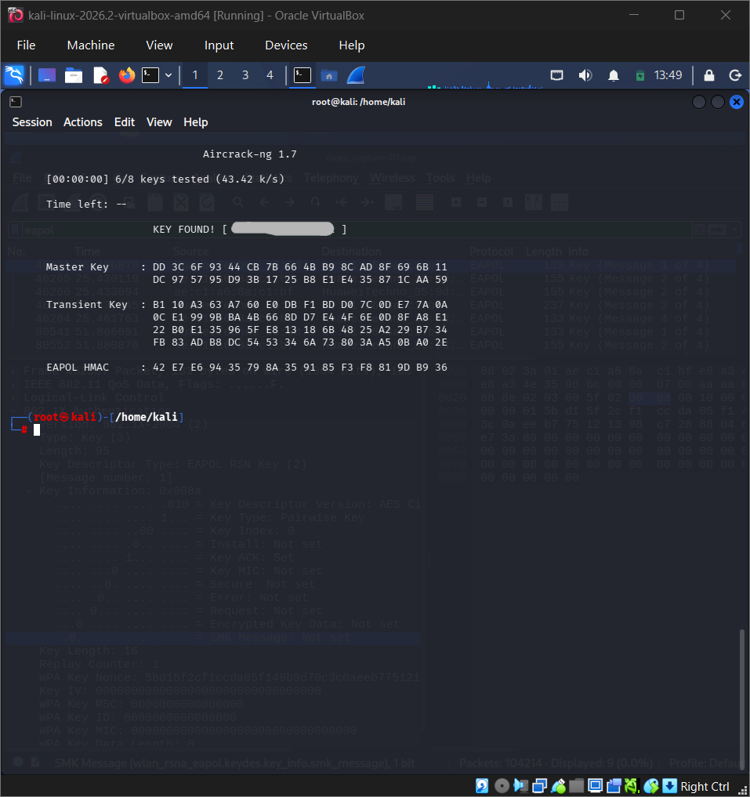

------------------------------------------------------------------------

# 🌐 Analisis Risiko ARP Spoofing / MitM

## 9. Pemeriksaan Lingkungan ARP Spoofing

Tahap berikut digunakan sebagai dokumentasi awal pengujian risiko ARP
Spoofing pada jaringan lokal.

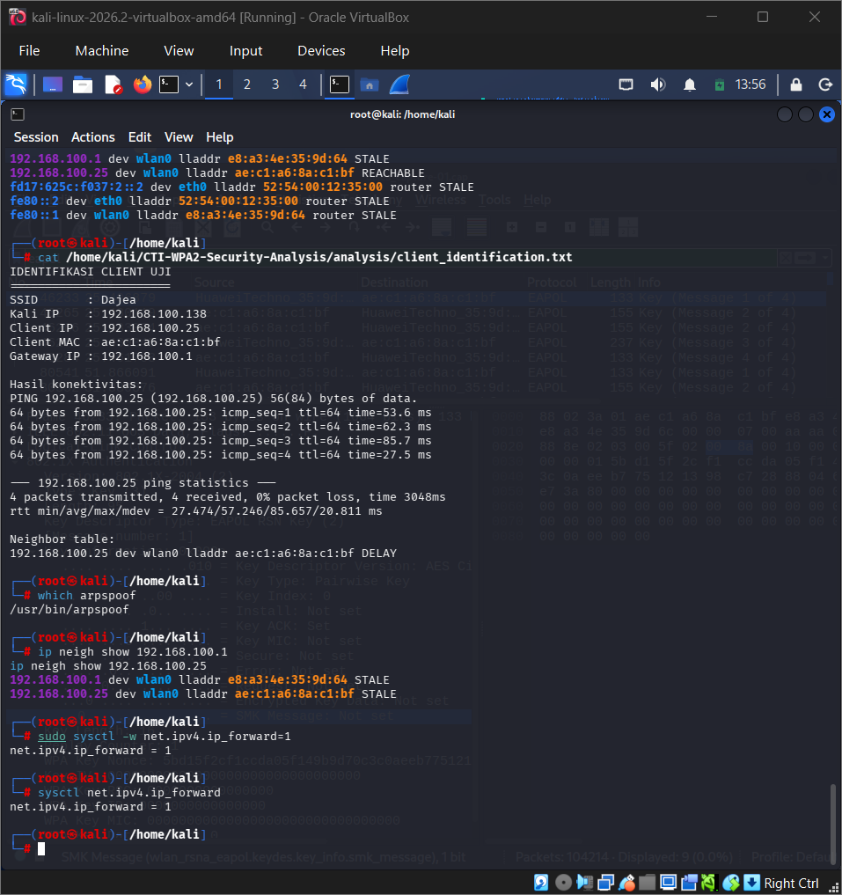

------------------------------------------------------------------------

## 10. Pengamatan Jalur Kali → Client

Dokumentasi traffic pada lingkungan laboratorium ketika skenario ARP
Spoofing/MitM diamati dari sisi Kali Linux menuju client.

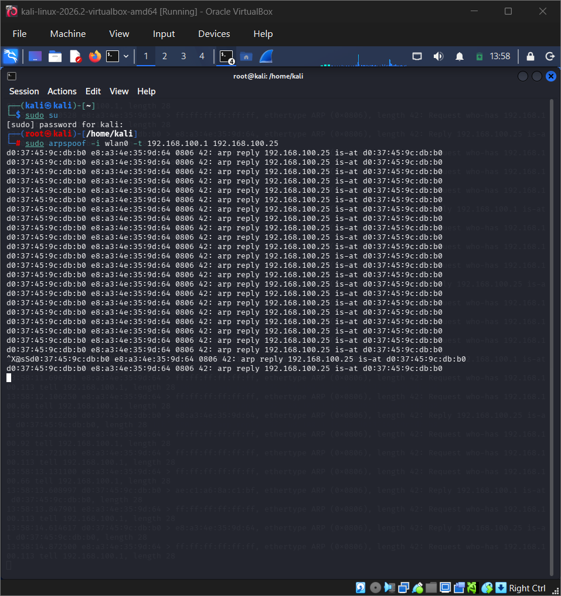

------------------------------------------------------------------------

## 11. Pengamatan Jalur Client → Kali

Pengamatan berikut menunjukkan sisi komunikasi client dalam skenario
laboratorium yang sama.


------------------------------------------------------------------------

## 12. Pengamatan ARP

Traffic ARP diamati untuk melihat perubahan komunikasi dan memahami
risiko manipulasi pemetaan IP-to-MAC pada jaringan lokal.


------------------------------------------------------------------------

## 13. Penghentian Forwarding Setelah Pengujian

Setelah skenario pengujian selesai, konfigurasi yang digunakan selama
eksperimen dihentikan sebagai bagian dari proses pemulihan lingkungan.

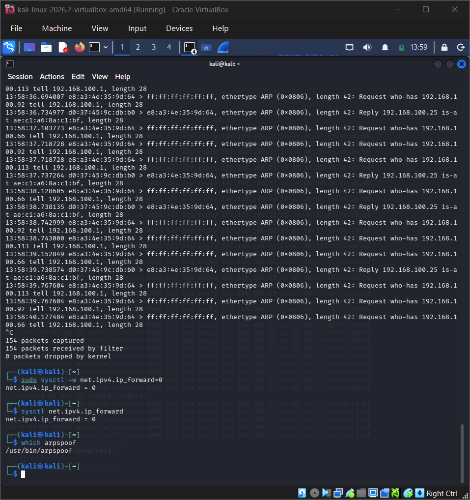

------------------------------------------------------------------------

## 14. Mengembalikan Kondisi Jaringan

Tahap terakhir pada skenario MitM adalah memastikan lingkungan jaringan
uji dikembalikan ke kondisi normal.


------------------------------------------------------------------------

# 🔑 Analisis WPA2 4-Way Handshake

WPA2 4-Way Handshake merupakan proses pertukaran pesan antara **Access
Point (AP)** dan **client** untuk membentuk dan mengonfirmasi material
kunci sebelum komunikasi terenkripsi digunakan.

Secara umum, hasil analisis proyek mendokumentasikan empat pesan
berikut.

## Message 1/4 --- AP → Client

Access Point mengirimkan **ANonce (Authenticator Nonce)** kepada client.

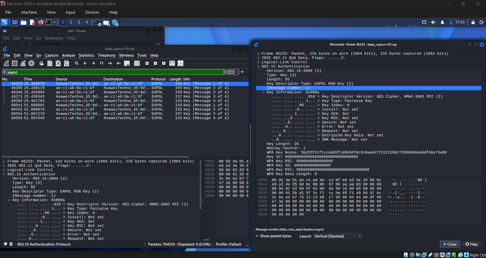

------------------------------------------------------------------------

## Message 2/4 --- Client → AP

Client mengirimkan **SNonce (Supplicant Nonce)** dan **MIC (Message
Integrity Code)** kepada Access Point.

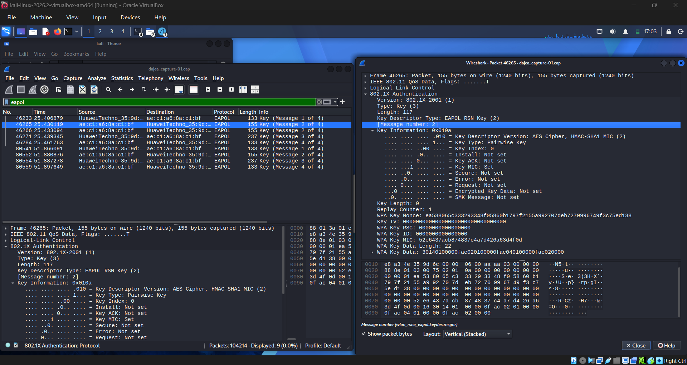

------------------------------------------------------------------------

## Message 3/4 --- AP → Client

Access Point melakukan konfirmasi dan mengirimkan informasi yang
berkaitan dengan instalasi kunci serta GTK terenkripsi.

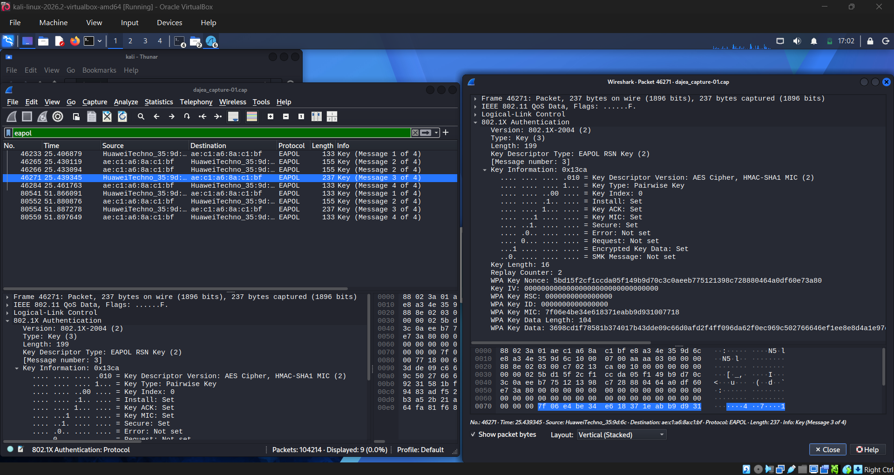

------------------------------------------------------------------------

## Message 4/4 --- Client → AP

Client mengirimkan konfirmasi akhir sehingga proses handshake dapat
diselesaikan dan sesi terenkripsi dapat dimulai.

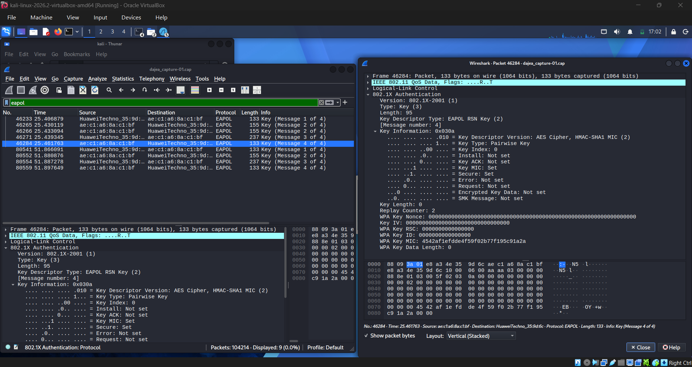

------------------------------------------------------------------------

## 🔐 Identifikasi Nonce

Analisis paket juga digunakan untuk mengidentifikasi informasi nonce
yang terlibat dalam proses WPA2 4-Way Handshake.

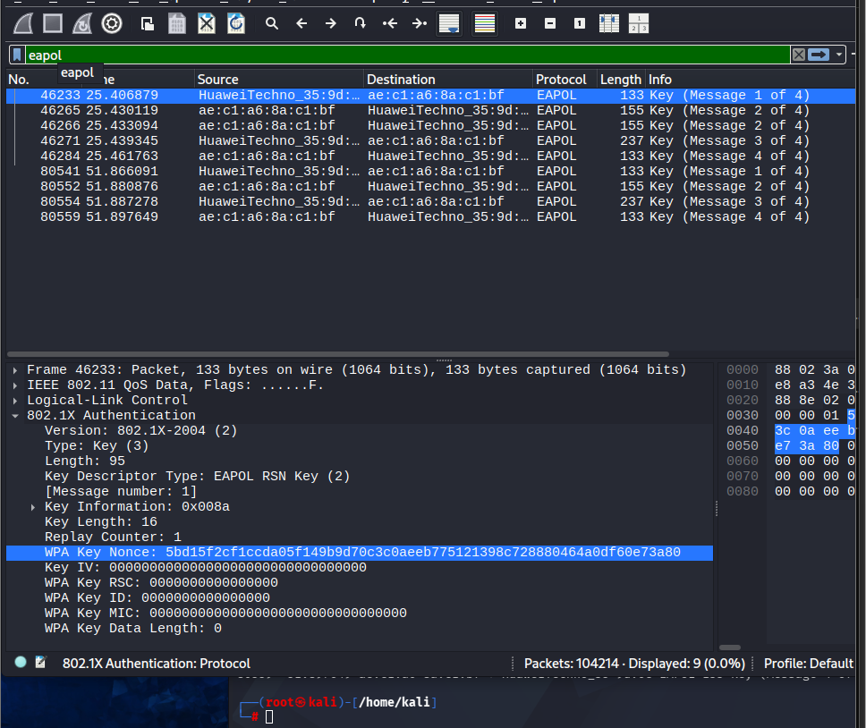

------------------------------------------------------------------------

# 🔄 Ringkasan 4-Way Handshake

``` text
        ACCESS POINT (AP)                         CLIENT
               |                                    |
               | -------- Message 1 / ANonce -----> |
               |                                    |
               | <--- Message 2 / SNonce + MIC ---- |
               |                                    |
               | ------ Message 3 / GTK + MIC ----> |
               |                                    |
               | <------ Message 4 / Confirm -------|
               |                                    |
               +====== Encrypted Communication =====+
```

------------------------------------------------------------------------

# ⚠️ Threat Intelligence & Mapping Kerentanan

  -----------------------------------------------------------------------
  Threat Vector     MITRE ATT&CK /    Risiko            Ringkasan
                    CVE                                 
  ----------------- ----------------- ----------------- -----------------
  Network Sniffing  T1040             Medium            Pengamatan
                                                        traffic jaringan
                                                        untuk memperoleh
                                                        informasi
                                                        komunikasi.

  WPA2 Handshake    T1110.001         🔴 High           PSK yang lemah
  Capture & Offline                                     dapat berisiko
  Cracking                                              terhadap
                                                        pengujian
                                                        dictionary secara
                                                        offline setelah
                                                        handshake
                                                        diperoleh.

  ARP Spoofing /    T1557.002         🟠 Medium-High    Manipulasi ARP
  MitM                                                  dapat mengalihkan
                                                        traffic lokal
                                                        melalui sistem
                                                        perantara.

  KRACK (Key        CVE-2017-13077    🔴 High           Berkaitan dengan
  Reinstallation                                        instalasi ulang
  Attack)                                               kunci/nonce pada
                                                        proses WPA2 4-Way
                                                        Handshake.
  -----------------------------------------------------------------------

------------------------------------------------------------------------

# 🧠 Analisis Threat Intelligence

## WPA2 Handshake & Password Security

Penangkapan 4-Way Handshake tidak secara langsung menampilkan PSK dalam
bentuk plaintext. Namun, data handshake dapat menjadi dasar pengujian
kandidat password secara offline. Karena itu, kekuatan PSK menjadi salah
satu faktor penting dalam keamanan WPA2-Personal.

## ARP Spoofing / Man-in-the-Middle

ARP pada jaringan lokal tidak menyediakan mekanisme autentikasi yang
kuat terhadap setiap pemetaan IP dan MAC. Kondisi tersebut dapat menjadi
risiko apabila perangkat menerima informasi ARP yang tidak sah.

## KRACK

Proyek juga membahas **Key Reinstallation Attack (KRACK)** dengan
referensi **CVE-2017-13077**, yang berkaitan dengan proses instalasi
ulang kunci pada implementasi WPA2.

------------------------------------------------------------------------

# 🛡️ Rekomendasi Mitigasi

### 1. Gunakan PSK yang Kuat

Gunakan password yang panjang dan sulit ditebak. Pada proyek ini
direkomendasikan PSK minimal **16--20 karakter** dengan kombinasi
karakter yang kuat untuk mengurangi risiko dictionary attack.

### 2. Patch dan Firmware Update

Access Point, router, serta perangkat client harus rutin diperbarui
untuk memperoleh perbaikan keamanan, termasuk perlindungan terhadap
implementasi yang terdampak KRACK.

### 3. Migrasi ke WPA3-Personal

Jika perangkat mendukungnya, pertimbangkan penggunaan **WPA3-Personal**
dengan **Simultaneous Authentication of Equals (SAE)** untuk
meningkatkan ketahanan terhadap pengujian password secara offline.

### 4. Wireless Monitoring / WIPS

Wireless Intrusion Prevention System dapat digunakan sebagai bagian dari
pemantauan terhadap aktivitas wireless yang tidak normal maupun
keberadaan Rogue AP.

### 5. Monitoring Jaringan Lokal

Pemantauan perubahan ARP dan segmentasi jaringan dapat membantu
mengurangi risiko serangan Man-in-the-Middle pada jaringan lokal.

------------------------------------------------------------------------

# 📊 Ringkasan Hasil

  Pengujian                  Hasil
  -------------------------- --------------------
  Environment Kali Linux     ✅ Siap
  Wireless Monitoring        ✅ Terdokumentasi
  Network Discovery          ✅ Terdokumentasi
  Packet Capture             ✅ Berhasil
  EAPOL Detection            ✅ Berhasil
  WPA2 Handshake             ✅ Terdokumentasi
  Message 1/4                ✅ Teridentifikasi
  Message 2/4                ✅ Teridentifikasi
  Message 3/4                ✅ Teridentifikasi
  Message 4/4                ✅ Teridentifikasi
  Nonce Analysis             ✅ Terdokumentasi
  Risiko Weak PSK            ✅ Dianalisis
  ARP Spoofing / MitM Risk   ✅ Dianalisis
  Network Recovery           ✅ Terdokumentasi

------------------------------------------------------------------------

# 📁 Struktur Repository

``` text
CTI-WPA2-Security-Analysis/
│
├── captures/
│   └── wpa2_handshake_sample.pcapng
│
├── screenshots/
│   ├── 01_environment.png
│   ├── 02_monitor_mode.png
│   ├── 03_network_discovery.png
│   ├── 04_wireshark_eapol.png
│   ├── 05_eapol_detail.png
│   ├── 06_Mengecek_Aircrack_mengenali_handshake.png
│   ├── 07_wordlist_password.png
│   ├── 08_key-found.png
│   ├── 09_pengecekan_Arpspoof.png
│   ├── 10_spoofing_kali-to-client.png
│   ├── 11_spoofing_client-to-kali.png
│   ├── 12_mengamati_ARP.png
│   ├── 13_mematikan-forwarding.png
│   ├── 14_mengembalikan-kondisi-jaringan-ke-normal.png
│   ├── 15_message_1.png
│   ├── 16_message_2.png
│   ├── 17_message_3.png
│   ├── 18_message_4.png
│   └── 19_kunci_nonce.png
│
├── README.md
└── references.md
```

------------------------------------------------------------------------

# 📚 Referensi

Referensi terkait **MITRE ATT&CK**, **KRACK/CVE**, WPA2, dan sumber
pendukung proyek disimpan pada:

``` text
references.md
```

------------------------------------------------------------------------

# ⚖️ Disclaimer

Proyek ini dibuat untuk **tujuan pendidikan, penelitian, dan dokumentasi
akademik Cyber Threat Intelligence**.

Seluruh pengujian keamanan harus dilakukan hanya terhadap perangkat,
jaringan, dan sistem yang dimiliki sendiri atau telah mendapatkan izin
dari pemiliknya. Penulis tidak mendorong penggunaan teknik yang dibahas
dalam repository ini untuk memperoleh akses tanpa izin.

------------------------------------------------------------------------

## 👤 Author

**\[NUR ALIYAH AMALIANI\]**\
NIM: **\[10584116923\]**\
Program Studi: **Informatika**

------------------------------------------------------------------------

⭐ **Cyber Threat Intelligence --- WPA2-Personal Security Analysis**
